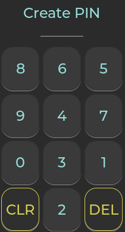
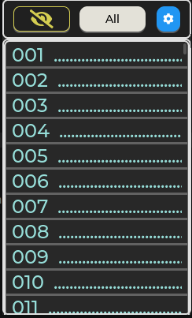
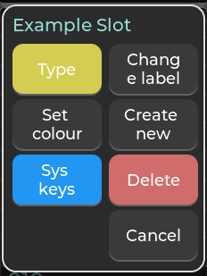
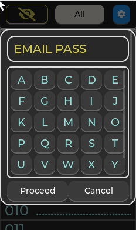
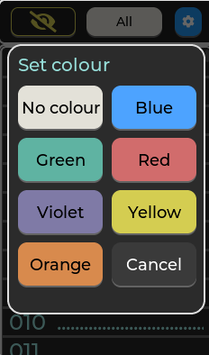
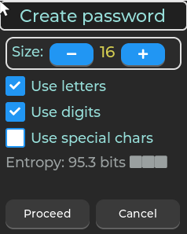
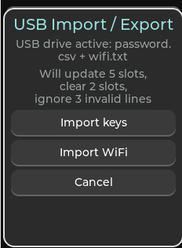

# User Manual

## 1. Welcome

This is your portable password vault with a touchscreen display.

What it can do:

- Hold up to 256 passwords
- Protect them with an 8-digit PIN
- Type passwords into your computer over USB like a keyboard
- Let you label and colour-code slots
- Generate secure passwords on the device
- Import and export passwords using USB storage
- Store WiFi details for firmware updates (you don't have to, but it's nice to get an update once in a while)
- Dim the screen and auto-lock when idle

Each slot is numbered from `001` to `256`.

---

## 2. First Start and Unlocking

### First boot


The first time you turn it on, the device asks you to:

1. Create a PIN
2. Repeat the PIN

If both entries match, the PIN is saved and you’re in.

If they don’t match, you’ll need to try again.

### Normal unlock

After setup, the lock screen shows `Enter PIN`.

- Enter exactly 8 digits
- The keypad numbers move around each time for extra security
- If the PIN is wrong, you’ll see `Wrong PIN` and can try again

---

## 3. Screen Lock

The device watches your touch activity.

- After the dim timeout, the screen gets darker
- After the lock timeout, it locks and asks for your PIN again
- From the slots screen, tap the  button if you want to lock the device immediately

Default settings:

- Dim timeout: 60 seconds
- Lock timeout: 120 seconds

---

## 4. Main Slots Screen

After unlocking, you’ll land on the slot list.



Top buttons:

-  lock now
-  filter by colour
-  open Settings

Slot list behaviour:

- Tap a row to select it
- Long-press a row to open the slot menu
- Empty or unlabeled slots show dotted placeholders
- Coloured slots have a matching row background

---

## 5. Slot Actions

Long-press a slot to open the menu.



Actions available:

- `Type`
- `Change label`
- `Set colour`
- `Create new`
- `Delete`
- `Cancel`

If the slot is empty, only `Create new` and `Cancel` are available.

### Type

`Type` sends the password over USB as if it was typed on a keyboard.

Important:

- The device must be connected to a host that accepts USB HID keyboard input (e.g. PC, Mac, Android or iOS phone)
- It only types password characters
- It does not press `Enter`, `Tab`, or any other key in the end

### Change label



Labels belong to each slot.

- Max length: 15 characters
- On-device input only accepts `A-Z` and `_`
- If you use USB import/export, more characters for labels are available
- Labels can also be blank or not exist at all (but you'll have to remember the slot number where you stored THAT specific password)

### Set colour



Available colours:

- `No colour`
- `Blue`
- `Green`
- `Red`
- `Violet`
- `Yellow`
- `Orange`

These colours help you visually highlight and sort the slots (for example, Red - passwords for work, Green - personal, etc).

### Create new



Use this screen to generate a password for the selected slot.

Generator options:

- Length: 8 to 64 characters
- `Use letters`
- `Use digits`
- `Use special chars`

You’ll also see an entropy estimate.

Notes:

- Default length is 16
- The password is built from the enabled character types
- The generator may not include every selected type in every password
- Once created, the password is saved directly into that slot

### Delete

Deleting a slot removes:

- password
- label
- colour

---

## 6. Settings

Tap the gear button on the slots screen to open Settings.

What you can do:

- `Lock Timeout`
- `Dim Timeout`
- `Flip screen`
- `Change PIN`
- `USB Import / Export`
- `Firmware update`
- `Factory Reset`
- `Security Status`
- `About`

### Lock Timeout

Choose from:

- 30 s
- 60 s
- 120 s
- 300 s
- 600 s

### Dim Timeout

Choose from:

- 5 s
- 15 s
- 30 s
- 60 s
- 90 s

The device ensures the dim timeout always happens before lock timeout.

### Flip screen

This rotates the display 180° and takes effect immediately. Convenient if your USB cable is connected from the top of the device, like mine.

### Change PIN

To change your PIN:

1. Enter current PIN
2. Enter new PIN
3. Repeat new PIN

Rules:

- PIN is always 8 digits
- Keypad digits are randomized each time
- if current PIN is wrong, you stay in the flow
- if new PIN entries don’t match, you try again

### Security Status

This overlay shows:

- flash encryption state
- flash encryption mode and key size if available
- password memory encryption state
- SecureBootV2 status

Tap anywhere to close it.

> The device you received is locked down, encrypted using AES-256, and signed with RSA-3072 key. Any attempt to tamper with the firmware in order to extract your super secret passwords will result in bricking. I'm not saying that it isn't possible, but surely it would be quite a difficult thing to do.

### About

This overlay shows:

- application name and version
- device MAC address
- build date and time
- firmware image SHA-256

Tap to close.

---

## 7. USB Import / Export

Open `Settings -> USB Import / Export`.



The device asks for your PIN before starting the USB session.

After PIN verification:

- it switches to USB mass storage mode
- you see a drive with `password.csv` and `wifi.txt`
- the screen shows summary info and action buttons

Session buttons:

- `Import keys`
- `Import WiFi`
- `Cancel`

### How it works

- `password.csv` contains your current slots (labels, passwords, colour numbers)
- you can back it up, edit it, and save it
- changes only apply when you press `Import keys`
- `Cancel` ends the session and discards staged changes

> In USB mass storage mode, the passwords are shown in clear text. Whenever you back up your passwords, consider using the off grid device (e.g. a standalone PC), copy the password file to a USB stick and bury it somewhere, as I do. Repeat regularly.

### password.csv format

Each line is:

```text
slot,label,password,colour_id
```

Example:

```text
001,EMAIL_MAIN,MySecret123,1
014,BANK_APP,s7f!2Xq9,3
128,SERVER_ROOT,RootPass!,0
```

Rules:

- `slot` must be `001` to `256`
- `label` max 15 characters
- `password` max 128 characters
- `colour_id` values:
  - `0` = no colour
  - `1` = blue
  - `2` = green
  - `3` = red
  - `4` = violet
  - `5` = yellow
  - `6` = orange
- labels and passwords can’t include commas or line breaks

To clear a slot, leave the password field empty:

```text
005,,,0
```

Import behavior:

- valid lines are staged
- invalid lines are ignored
- the summary shows:
  - slots to update
  - slots to clear
  - invalid lines ignored

### wifi.txt format

`wifi.txt` must contain exactly two lines:

```text
YOUR_WIFI_SSID
YOUR_WIFI_PASSWORD
```

- Line 1 = SSID
- Line 2 = password

Edit and save the file, then press `Import WiFi` to apply it.

---

## 8. Firmware Update

Open `Settings -> Firmware update`.

The device will show a warning. Tap `OK` to continue or `Cancel` to go back.

What it does under the hood:

1. Connect to the WiFi using the stored WiFi credentials
2. Sync time over NTP (we need this for encrypted connections)
3. Check the update manifest
4. If new version is available, download and verify the update
5. Flash the new firmware
6. Reboot automatically if successful

Notes:

- the screen shows update progress
- if no update is available, you’ll be told you’re up to date
- a successful update reboots automatically
- if the update fails or is canceled before reboot, the device goes back to normal mode

Important recommendation:

> Always back up your passwords before running a firmware update. If anything goes wrong during the update, you don’t want to lose access to your stored credentials.

---

## 9. Factory Reset

Open `Settings -> Factory Reset`.

The device asks you to confirm first.

If you press `Proceed`:

- a 30-second countdown starts
- press `Cancel` before it ends to stop it
- if the countdown completes, the device erases password memory and reboots

Factory reset removes:

- stored PIN
- slot labels
- saved passwords
- colours
- settings
- WiFi credentials

---

## 10. Quick Reference

### Unlock

- enter 8-digit PIN on the randomized keypad

### Open slot menu

- long-press a slot row

### Generate password

- long-press slot -> `Create new`

### Type password

- connect USB to host -> long-press slot -> `Type`

### Import CSV

1. open `Settings -> USB Import / Export`
2. enter PIN
3. edit `password.csv`
4. finish host writes safely
5. press `Import keys`

### Import WiFi

1. open `Settings -> USB Import / Export`
2. enter PIN
3. edit `wifi.txt`
4. press `Import WiFi`

### Change PIN

- `Settings -> Change PIN`

### Factory reset

- `Settings -> Factory Reset`
